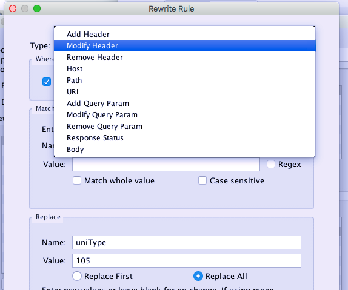
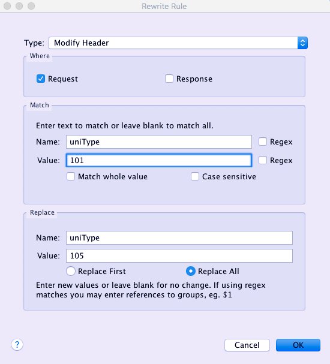

# charles 重写请求

charles 和fiddler既然都可以拦截返回体，没有理由不可以拦截请求是不是？

我这里只说charles吧。

###  配置重写域名
1. 进入菜单 Tools -> Rewrite 可见如下界面

2. 点击sets 区域的Add按钮添加重写任务。
3. 在右侧的Locations区域点击Add按钮添加需要重写的请求的域名

###  配置域名下的重写规则

1. 选中上一个步骤中添加的域名，在Rules区域点击Add按钮

2. 在Type项那里选择重写类型

有以上几种类型可供选择。
从上图可以看出来，重写规则可以重写请求头部和请求体，也可以重写返回头部和返回体。

这个功能不仅能调试身份认证信息，还能调试跨域网站，以及接口数据。

3. 在Match和Replace区域配置重写规则

上图将请求头部uniType的值替换为105，仅当uniType的值为101的时候才替换。