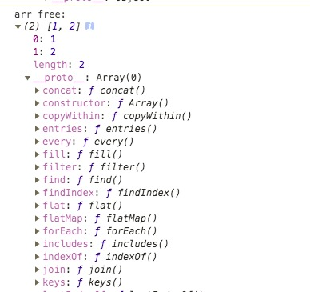

定义了如下一个对象：

```javascript
let arr = {
  a: []
}
Object.defineProperty(arr, 'a', {
  get() {
    console.log('get')
    return []
  },
  set(val) {
    console.log('set')
  }
})
```
当执行`arr.a = [1, 2]`时输出
```
set
```
当执行`arr.a.push(1)`或者`arr.a[0] = 1`时输出
```
get
```
这说明，Array的元素的增减不会触发setter。

那，为什么在 Vue中，`arr.a[0] = 1`不会触发视图更新，但是`arr.a.push(1)`却可以呢。

> Vue 将被侦听的数组的变异方法进行了包裹，所以它们也将会触发视图更新。这些被包裹过的方法包括： push, pop, shift, unshift, splice, sort, reverse

截取核心的代码实现：

```javascript
/* observer/array.js */
import { def } from '../util/index'

const arrayProto = Array.prototype
export const arrayMethods = Object.create(arrayProto)

[
  'push',
  'pop',
  'shift',
  'unshift',
  'splice',
  'sort',
  'reverse'
]
.forEach(function (method) {
  // cache original method
  const original = arrayProto[method]
  def(arrayMethods, method, function mutator (...args) {
    // 执行默认行为 original: Array.prototype[method]
    const result = original.apply(this, args)
    // ob: Observer实例
    const ob = this.__ob__
    // 获取数组中新增的元素，并为其添加watcher
    let inserted
    switch (method) {
      case 'push':
      case 'unshift':
        inserted = args
        break
      case 'splice':
        inserted = args.slice(2)
        break
    }
    if (inserted) ob.observeArray(inserted)
    // notify change
    ob.dep.notify()
    return result
  })
})
// ------------------------------------- //

/* util/lang.js */
/**
 * Define a property.
 */
export function def (obj: Object, key: string, val: any, enumerable?: boolean) {
  Object.defineProperty(obj, key, {
    value: val,
    enumerable: !!enumerable,
    writable: true,
    configurable: true
  })
}
// ------------------------------------- //
/* observer/index.js */
import { arrayMethods } from './array'

function protoAugment (target, src: Object, keys: any) {
  target.__proto__ = src
}
function copyAugment (target: Object, src: Object, keys: Array<string>) {
  for (let i = 0, l = keys.length; i < l; i++) {
    const key = keys[i]
    def(target, key, src[key])
  }
}

// ...
export class Observer {
  value: any;
  dep: Dep;
  vmCount: number; // number of vms that has this object as root $data

  constructor (value: any) {
    this.value = value
    this.dep = new Dep()
    this.vmCount = 0
    def(value, '__ob__', this)
    if (Array.isArray(value)) {
      const augment = hasProto
        ? protoAugment
        : copyAugment
      augment(value, arrayMethods, arrayKeys)
      this.observeArray(value)
    } else {
      this.walk(value)
    }
  }
  // ...
  /**
   * Observe a list of Array items.
   */
  observeArray (items: Array<any>) {
    for (let i = 0, l = items.length; i < l; i++) {
      observe(items[i])
    }
  }
}
```
输出挂载在Vue实例上的数组和未挂载在Vue实例上的数组进行比较：

```html
<html lang="en">
<head>
    <meta charset="UTF-8">
    <script src="https://cdn.jsdelivr.net/npm/vue/dist/vue.js"></script>
</head>
<body>
  <div></div>
</body>
<script>
new Vue({
  data: {
    arr: [1, 2]
  },
  created() {
    console.log('arr on vue:', this.arr)
    console.log('arr free:', [1, 2])
  }
})
</script>
</html>
```
输出对比：



可以看出来，挂载在vue实例上的数组，原型是arrayMethods，arrayMethods继承于Array。

上面输出的结果说明了什么？只有调用了数组上的'push','pop','shift','unshift','splice','sort','reverse'方法，才能触发watcher更新DOM。

可运行下面的代码以做验证：
```html
<html lang="en">
<head>
    <meta charset="UTF-8">
    <script src="https://cdn.jsdelivr.net/npm/vue"></script>
</head>
<body>
  <div id="app">
    <div v-for="number in arr">
      {{number}}
    </div>
    <button @click="push">push</button>
    <button @click="rawPush">rawPush</button>
  </div>
</body>
<script>
new Vue({
  el: '#app',
  data: {
    arr: [1, 2]
  },
  methods: {
    push() {
      this.arr.push('3')
    },
    rawPush() {
      Array.prototype.push.apply(this.arr, [4])
    }
  }
})
</script>
</html>
```
上面的代码中，push方法执行后视图立即更新。rawPush方法执行后视图没有更新，但是内容有push成功。下次执行push方法才会把rawPush进去的值渲染出来。

为什么有时候直接对数组的某个元素赋值却发现有更新呢？

原因是存在搭便车的情况。请看如下代码：

```html
<template>
  <div>
    <button @click="changeArr">修改arr</button>
    <button @click="changeProp">修改prop</button>
    <button @click="changeBoth">一起修改</button>
    <div>arr:</div>
    <div v-for="(item, $index) in arr" :key="$index">{{item}}</div>
    <div><br>prop:</div>
    <div>{{JSON.stringify(prop)}}</div>
  </div>
</template>

<script>
export default {
  data() {
    return {
      arr: [1, 2],
      prop: {
        a: {
          b: {
            c: ''
          }
        }
      }
    }
  },
  methods: {
    changeProp() {
      this.prop.a.b.c = 'hello'
    },
    changeArr() {
      this.arr[0] = 111
    },
    changeBoth() {
      this.changeProp()
      this.changeArr()
    }
  }
}
</script>
```
对数组的某个元素直接修改，视图不会先更新，除非在修改之后其它因素触发了视图更新。

假如，prop属性没有渲染在视图中，那么，点击任何一个按钮都不会刷新视图。