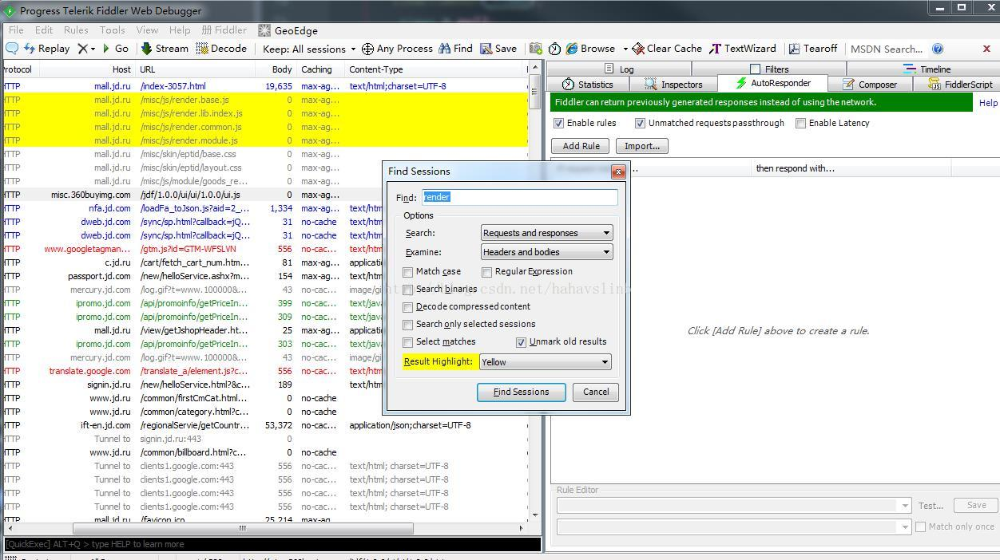
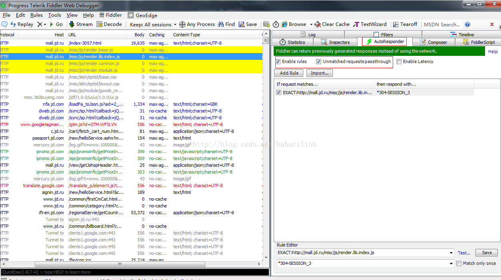
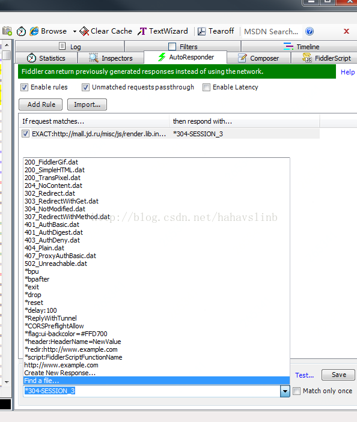
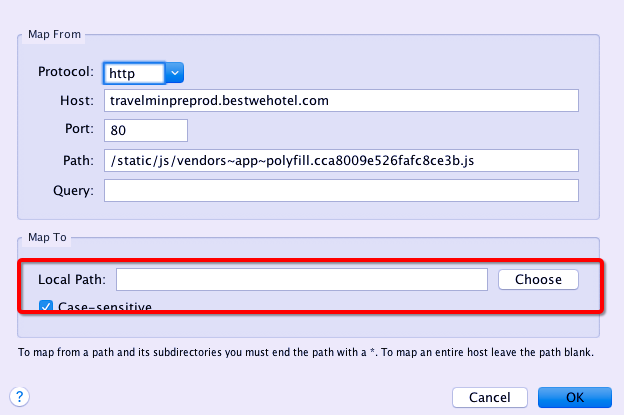
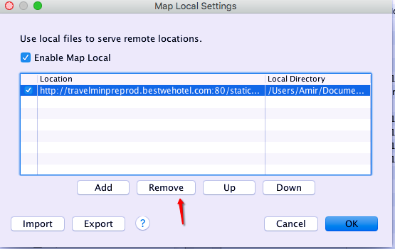

# 抓包工具调试线上代码

web应用代码混淆和压缩可以一定程度上缩短代码的请求时间，从而提高页面的访问体验，但是却不方便调试。这里教大家使用抓包工具调试线上代码。

以下方法假设你已经成功用fiddler或者charles代理你要调试的线上应用。

## fiddler拦截客户端代码

很久以前遇到一个线上问题，本地不能复现，而且还是手机浏览器环境，而且客户端报错日志找不到相关的问题。当时想到的调试方法就是使用fiddler修改返回的js代码，开启vconsole的debug模式查看页面报错信息。这个方法其实就是拦截返回js并正则匹配内容进行修改。
### 局部修改

使用fildder可以拦截http返回内容并修改。

#### 1.打开CustomRules.js

点击fiddler的Rules=>Customize Rules，FiddlerScript editor工具就会自动的打开CustomRules.js文件。

#### 2.修改 OnBeforeResponse 函数

假如，我想把http://my.example.com/index.html 资源返回代码中的"vconsole.debug = false"改为"vconsole.debug = true"，只需要在这个函数中插入一个if语句。可以这样写：
```
//判断Url内容中是否包含特定内容，针对这个Url进行下面的操作
if (oSession.uriContains("my.example.com/index.html")) { 
  oSession.utilDecodeResponse();
  oSession.utilReplaceInResponse("vconsole.debug = false", "vconsole.debug = true");
} 
```
  
这个方法比较难操作，毕竟你需要先找到要修改的代码，确保需要替换的内容是独一无二的，而且，如果想修改替换内容需要重新修改替换逻辑。更加简单粗暴的方法是直接下载代码下来，将这个资源代理到本地，想怎么修改就怎么修改。

###  fiddler将代码代理到本地

#### 1.找到你需要代理的请求


标黄的请求就是目标请求，拖拽到右侧的AutoResponse标签中

#### 2.选中代理选项

勾选右侧AutoResponse标签中的

> 1. Enable rules：开启重定向使规则生效，指的是代理到本地这个规则。
> 2. Umatched requests passthrough:不影响那些没满足我们处理条件的请求通过。



#### 3.选择需要代理的到的本地文件

上图右侧选中第一步拖进去的请求，并在右下角的Rule Editor中的第二个下拉框选择Find a file。此时会打开本地资源管理器要求你选择文件。



#### 4.修改代码刷新页面

修改上一步你选中的代码，保存之后刷新你要调试的页面，重新加载的资源就回变成你本地的资源。

## charles拦截客户端代码

### 设置map local

在请求中找到需要调试的代码文件，右键，菜单中选择 Map Local

弹窗中选择需要映射到的本地文件

点OK即可。
### 重新请求对应的资源
发现已经是本地的代码文件了。这时候可以随意的修改代理到的本地文件调试。

### 取消map
在Tools->Map Local菜单下可以删除刚刚添加的map。



