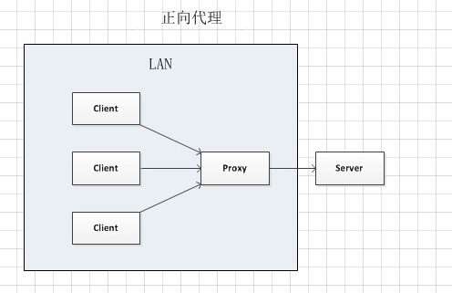

# 正向代理和反向代理的区别

## 正向代理

位于客户端和服务器之间的代理服务器，对服务器不可见。

客户端可以访问该代理服务器，但是客户端不直接访问代理背后的服务器，或者客户端根本没办法访问代理背后的服务器。

客户端需要明确指定代理服务器的地址。以及可能需要身份认证来限制其它客户端随意访问。

正向代理比较常见的使用场景是翻墙，局域网抓包。

## 反向代理

隐藏于服务器背后，对客户端不可见

客户端访问的服务器本身就是反向代理服务器，只是客户端不知情。反向代理服务器将客户端的请求代发给其背后的服务器，拿到结果并传回给客户端。

反向代理比较常见的场景是本地代码调试线上接口，表面访问本地接口，但是由本地反向代理服务器将接口转发到线上地址以解决接口跨域问题。
另外一个常用的场景是服务器负载均衡，以及外网灰度发布。

外网灰度发布举个例子，反向代理负责将请求转发给3个服务器，这3个服务器上的代码有一个是旧版本，另外2个是新版本。代理服务器将某些ip段客户端的请求转发给旧版本，其它的转发给新版本。这样就可以达到灰度发布的效果。
